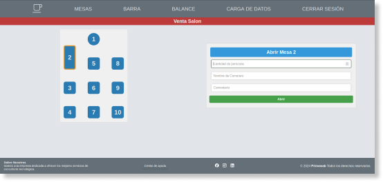

# 📋 Sistema de Facturación – Restaurante/Bar

Aplicación web ligera en **HTML, CSS y JavaScript** para la gestión de ventas en restaurantes y bares.  
Permite manejar **mesas**, **ventas en barra**, **balance de caja** y **carga de productos** de manera sencilla, sin necesidad de backend (usa **LocalStorage** como almacenamiento).  

.

## 📑 Tabla de Contenidos
- [Características](#características)  
- [Estructura del Proyecto](#estructura-del-proyecto)  
- [Instalación](#instalación)  
- [Uso](#uso)  
- [Módulos del Sistema](#módulos-del-sistema)  
- [Dependencias](#dependencias)  
- [Contribución](#contribución)  
- [Licencia](#licencia)  

---

## ✨ Características
- 📌 **Gestión de mesas**: abrir/cerrar mesas, asignar camarero, pedidos y facturación.  
- 🍹 **Ventas de barra**: carga rápida de productos y cierre de cuentas individuales.  
- 📊 **Balance del día**: registro de gastos y sumatoria de ventas almacenadas en **LocalStorage**.  
- 🛠 **Carga de productos**: formulario para registrar nombre, precio e imagen de productos.  
- 💾 **Persistencia en LocalStorage**: guarda ventas parciales y las muestra en balance.  
- 🔍 **Búsqueda de productos** en tiempo real.  
- 🎨 Interfaz con CSS y componentes reutilizables.  

---

## 📂 Estructura del Proyecto
```
project/
│── index.html          # Inicio de sesión y menú principal
│── pages/
│   ├── mesas.html      # Gestión de mesas
│   ├── barra.html      # Ventas de barra
│   ├── balance.html    # Balance de gastos y ventas
│   ├── carga-datos.html# Registro de productos
│── scripts/
│   ├── mesas.js        # Lógica de mesas
│   ├── barra.js        # Lógica de barra
│   ├── balance.js
|   ├── footer.js       # Lógica de footer
│── css/                # Estilos (normalize, generales y específicos)
│── img/                # Imágenes y logo
└── db/
    └── productos.json  # Catálogo de productos
```

---

## ⚡ Instalación
No requiere instalación compleja.  
1. Descarga o clona el repositorio:  
   ```bash
   git clone <URL_DEL_REPO>
   cd proyecto
   ```
2. Abre `index.html` en tu navegador.  
3. ¡Listo! 🚀

---

## ▶️ Uso
1. **Inicio de sesión** en `index.html`.  
2. Navega entre módulos desde el menú:  
   - **Mesas** → gestiona pedidos por mesa.  
   - **Barra** → registra ventas rápidas.  
   - **Balance** → consulta ventas del día y registra gastos.  
   - **Carga de Datos** → agrega productos al catálogo.  

---

## 🧩 Módulos del Sistema
### 🔹 Mesas (`mesas.html` + `mesas.js`)
- Abrir mesa con número de personas, camarero y comentario.  
- Cargar productos al pedido y generar factura.  
- Reiniciar o cerrar mesa (venta guardada en LocalStorage).  

### 🔹 Barra (`barra.html` + `barra.js`)
- Selección de productos disponibles.  
- Generación rápida de factura.  
- Reinicio o cierre de venta (acumula en LocalStorage).  

### 🔹 Balance (`balance.html` + `balance.js`)
- Registro de gastos con comentario y monto.  
- Muestra ventas acumuladas desde LocalStorage.  
- Calcula el **total de ventas del día**.  

### 🔹 Carga de Productos (`carga-datos.html`)
- Formulario para registrar nombre, precio e imagen.  
- (Opcional: permite editar productos).  

---

## 📦 Dependencias
- **Frontend:** HTML5, CSS3, JavaScript (vanilla).  
- **Almacenamiento:** LocalStorage (navegador).  
- **Estilos base:** `normalize.css` y hojas personalizadas.  

---
 


